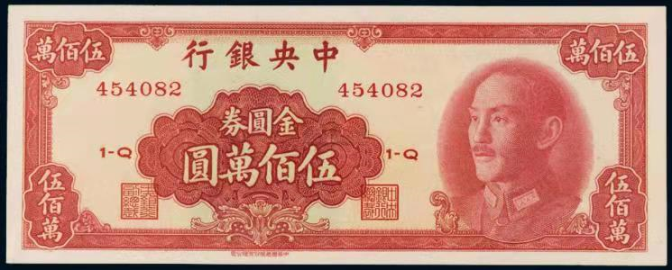

# Typora的使用

[toc]


### 快捷键

- 标题：

  - 鼠标光标放在行内某位置，Ctrl+1就是1级标题，Ctrl+6就是6级标题，其他同理
  - 在行前打一个#号加空格，就是1级标题；打2个#号加空格，就是二级标题

- 打开关闭大纲视图    Ctrl+Shift+1

- 加粗：Ctrl+B

- *字体倾斜：Ctrl+i*

- <u>下划线：Ctrl+U</u>

- 插入删除链接：Ctrl+K。可以是超链接、可以链接本地pdf文件等等。

- 快速切换预览和源码模式     Ctrl+/

- 新建一个文档：Ctrl+N

- 创建表格：Ctrl+T

  | id   | name | age  |
  | :--- | :--- | ---- |
  | 1    | 张健 | 25   |
  | 2    | 李四 | 26   |


- ~~删除线~~：Alt+Shift+5

- 插入行内代码：Ctrl+Shift+K

- 插入数学公式块：Ctrl+Shift+M 
  $$
  y=kx+5
  $$

- 引用：Ctrl+Shift+Q 

- 插入图片：Ctrl+Shift+i    。还可以把图片拖进来。

- 本文搜索是Ctrl+F、搜索并替换是Ctrl+H。如果是在所有文档中查找的话，Ctrl+Shift+F

- 换行：Enter键 。换行能紧凑：[如果希望紧凑一些](https://jingyan.baidu.com/article/4dc408488cba8089d946f1ec.html)，按住【shift】+【enter】换行操作的话，就不会有空行了。shift在eclipse里也是换行。

- 有序列表，Ctrl+Shift+[     无序列表 Ctrl+Shift+]

- 分割线：输入 `***` 或者 `---` 再按回车即可绘制一条水平线 

- 脚注：我的搜索引擎一般使用谷歌[^1]

  ```
  脚注标识    [^1]
  脚注解释    [^1]:因为谷歌广告少
  ```

- 上标 8=2<sup>3</sup>、下标 H<sub>2</sub>O

  ```
  <sup>内容</sup>   举例  8=2<sup>3</sup>
  <sub>内容</sub>   举例  H<sub>2</sub>O
  ```

  

- 生成动态内容目录[^2]： 在你需要生成内容的位置 [toc] 然后Enter。 

- 高亮   ==完颜阿骨打==

  ```
  ==内容==
  ```





### 其他

- Markdown 使用了很多特殊符号来表示特定的意义，如果需要显示特定的符号则需要使用转义字符，Markdown 使用反斜杠转义特殊字符：

  Markdown 支持以下这些符号前面加上反斜杠来帮助插入普通的符号：

  ```
  \   反斜线
  `   反引号
  *   星号
  _   下划线
  {}  花括号
  []  方括号
  ()  小括号
  #   井字号
  +   加号
  -   减号
  .   英文句点
  !   感叹号
  ```

  

- 表情符号  输入英文冒号然后输入不同的表情符号码 ,比如输入：smile 就会出来   :smile_cat:
- 

- 直接粘贴前端代码嵌入本地视频

  

  

  <video id="video" controls="" preload="none">
      <source id="mp4" src="E:\大礼包-其他项目\微信小程序\小程序 慕课网-沃森博客（wosn.net）分享\第六章\第六章15-17.mp4" type="video/mp4">
  </video>

- 嵌入B站视频：


<iframe src="//player.bilibili.com/player.html?aid=669255142&bvid=BV1ja4y177MR&cid=227857172&page=1" scrolling="no" border="0" frameborder="no" framespacing="0" height="500" allowfullscreen="true"> </iframe>


- [java继承的学习PDF](E:\学习资料\4.0  javaSE加强资料\4月14日JavaSE加强资料文档\01继承、方法重写、修饰符介绍\素材\PPT\01_继承.pdf)

> 参考链接1： [Typora入门：全网最全教程](https://www.cnblogs.com/hider/p/11614688.html#%E5%B8%B8%E7%94%A8%E5%BF%AB%E6%8D%B7%E9%94%AE)

> 参考链接2：

[^2]:toc：table of contents  内容目录。TOC从文档中提取所有标题，其内容将自动更新，所以目录之间的级别关系是根据你的标题级别来定的。自我规范：使用1级标题、3级标题、6级标题
[^1]:因为谷歌广告少


